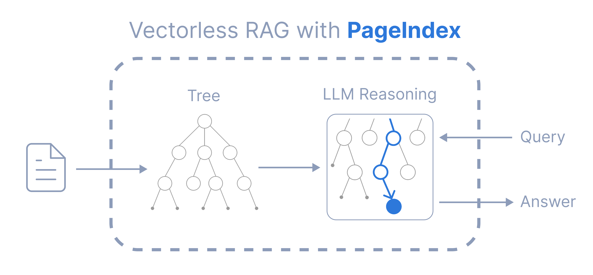
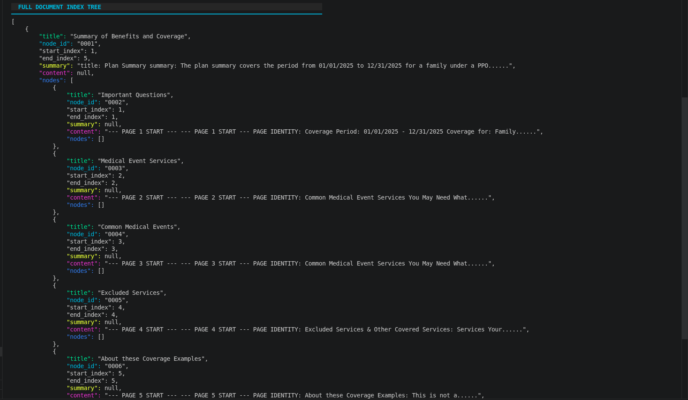
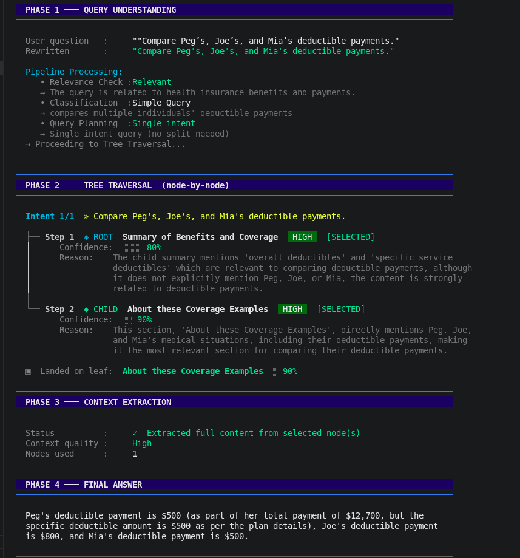
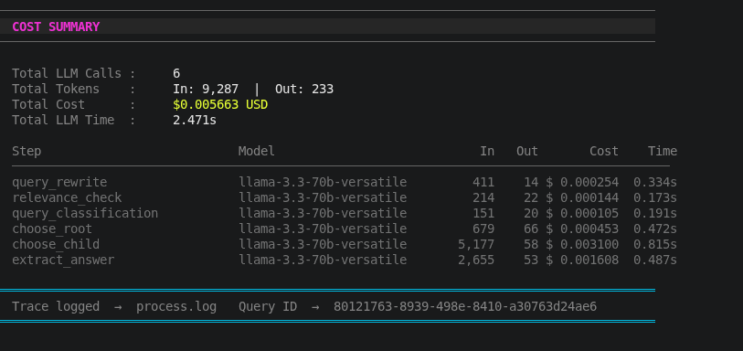

# 📄 PageIndexing RAG — Insurance & SBC Document QA

<p align="center">
  
</p>

<p align="center">
  <strong>Vectorless RAG for insurance & SBC documents — no embeddings, no vector DB, just a tree.</strong>
</p>

<p align="center">
  
  
  
  
  
</p>

---

> A production-ready **Retrieval-Augmented Generation (RAG)** pipeline for querying **insurance and Summary Plan Description (SPD) documents** — without relying on a Table of Contents or vector embeddings. Built on hierarchical page-aware indexing and multi-phase LLM tree traversal for precise, cost-efficient answers.

---

## 🧠 Why This Project?

Insurance and SBC documents are notoriously hard to query:

- They have **no consistent TOC** or heading structure
- Content is **spread across pages** with implicit relationships
- Standard chunk-based RAG loses hierarchical context and returns noisy results

This project solves those problems by:

1. **Parsing** documents into semantically structured HTML pages
2. **Indexing** them as a hierarchical tree of nodes (root → children)
3. **Traversing** the tree at query time — node by node — guided by LLM reasoning
4. **Extracting** a precise, grounded answer with full cost and trace logging

---

## ✨ Features

- 🌲 **Hierarchical Tree Indexing** — page-aware, aggregated node structure, no vector DB needed
- 🔍 **4-Phase Retrieval Pipeline** — query understanding → tree traversal → context extraction → answer
- 💡 **Smart Query Planning** — rewrites, relevance checks, and intent classification before retrieval
- 💰 **Per-query Cost Tracking** — token counts, USD cost, and latency for every LLM step
- 🗂️ **Chat History Support** — multi-turn conversation memory
- 📊 **RAG Evaluation Module** — built-in eval script using OpenRouter (Claude 3 Haiku)
- 🧾 **Trace Logging** — every query logged to `process.log` with a unique Query ID
- ⚡ **Ultra-low cost** — ~$0.006 per query with Groq + Llama 3.3 70B

---

## 🏗️ Architecture Overview

### How It Works

```
PDF / SBC Document
       │
       ▼
┌─────────────────────┐
│   INGESTION          │
│  ┌───────────────┐  │
│  │   Parsing     │  │  Docling + Custom HTML Structuring
│  │  parse.py     │  │
│  └──────┬────────┘  │
│         │           │
│  ┌──────▼────────┐  │
│  │   Indexing    │  │  Hierarchical Page-Aware Aggregation
│  │  aggregator   │  │
│  └──────┬────────┘  │
└─────────┼───────────┘
          │
          ▼
   Document Index Tree (JSON)
          │
          ▼
┌─────────────────────────────────────────┐
│          QUERY RETRIEVAL                │
│                                         │
│  Phase 1 ── Query Understanding         │
│    • Query Rewrite                      │
│    • Relevance Check                    │
│    • Classification (Simple/Complex)    │
│    • Query Planning (Single/Multi)      │
│                                         │
│  Phase 2 ── Tree Traversal              │
│    • Choose Root Node                   │
│    • Choose Child Node (recursive)      │
│    • Land on Best Leaf                  │
│                                         │
│  Phase 3 ── Context Extraction          │
│    • Extract full content of leaf node  │
│                                         │
│  Phase 4 ── Final Answer                │
│    • Grounded answer from context       │
└─────────────────────────────────────────┘
          │
          ▼
   Answer + Cost Summary + Trace Log
```

---

### 🌲 Document Index Tree Structure

Documents are indexed as a nested JSON tree during ingestion. Each node contains a title, page range, semantic summary, content, and child nodes — forming a navigable hierarchy that mirrors the document's logical structure.

<p align="center">
  
  <br/>
  <em>Full Document Index Tree generated from an SPD document — hierarchical JSON with per-node summaries</em>
</p>

Each node schema:

```json
{
  "title": "Summary of Benefits and Coverage",
  "node_id": "0001",
  "start_index": 1,
  "end_index": 5,
  "summary": "Plan Summary: covers 01/01/2025 to 12/31/2025 for a family under a PPO...",
  "content": null,
  "nodes": [
    { "title": "Important Questions",          "node_id": "0002", ... },
    { "title": "Medical Event Services",       "node_id": "0003", ... },
    { "title": "Common Medical Events",        "node_id": "0004", ... },
    { "title": "Excluded Services",            "node_id": "0005", ... },
    { "title": "About these Coverage Examples","node_id": "0006", ... }
  ]
}
```

---

### 🔍 Live Query Demo — 4-Phase Pipeline Trace

Every query is processed through 4 structured phases with full reasoning transparency at each step.

<p align="center">
  
  <br/>
  <em>Query: "Compare Peg's, Joe's, and Mia's deductible payments." — full pipeline trace from rewrite to final answer</em>
</p>

| Phase | Step | Result |
|-------|------|--------|
| Phase 1 | Relevance Check | ✅ Relevant — health insurance & payments |
| Phase 1 | Classification | Simple Query |
| Phase 1 | Query Planning | Single Intent (no split needed) |
| Phase 2 | Root Selected | Summary of Benefits and Coverage — **80% confidence** |
| Phase 2 | Child Selected | About these Coverage Examples — **90% confidence** |
| Phase 3 | Context | Full leaf content extracted — quality: **High** |
| Phase 4 | Answer | Peg: **$500** · Joe: **$800** · Mia: **$500** |

---

### 💰 Cost Summary — Per-Query Breakdown

Every query ends with a full cost report: tokens in/out, USD cost, and latency for each of the 6 LLM calls.

<p align="center">
  
  <br/>
  <em>Cost summary for the sample query above — 6 LLM calls totalling $0.005663 in 2.471s</em>
</p>

| Step | Model | Tokens In | Tokens Out | Cost | Time |
|------|-------|-----------|------------|------|------|
| query_rewrite | llama-3.3-70b-versatile | 411 | 14 | $0.000254 | 0.334s |
| relevance_check | llama-3.3-70b-versatile | 214 | 22 | $0.000144 | 0.173s |
| query_classification | llama-3.3-70b-versatile | 151 | 20 | $0.000105 | 0.191s |
| choose_root | llama-3.3-70b-versatile | 679 | 66 | $0.000453 | 0.472s |
| choose_child | llama-3.3-70b-versatile | 5,177 | 58 | $0.003100 | 0.815s |
| extract_answer | llama-3.3-70b-versatile | 2,655 | 53 | $0.001608 | 0.487s |
| **TOTAL** | | **9,287** | **233** | **$0.005663** | **2.471s** |

---

## 🛠️ Tech Stack

| Component | Technology |
|-----------|------------|
| LLM Inference | [Groq](https://groq.com) — Llama 3.3 70B Versatile |
| Evaluation LLM | [OpenRouter](https://openrouter.ai) — Claude 3 Haiku |
| Parsing Engine | [Docling](https://github.com/DS4SD/docling) + Custom HTML Structuring |
| Indexing Strategy | Hierarchical Page-Aware Aggregation |
| Language | Python 3.13 |
| Environment | Virtual Environment (`venv`) |

---

## 📁 Project Structure

```
indexing_for_sbc/
│
├── assets/                               # README images
│   ├── pageindex_diagram.png             # Architecture overview diagram
│   ├── query_pipeline_demo.png           # Live query pipeline screenshot
│   ├── cost_summary_demo.png             # Cost summary screenshot
│   └── document_index_tree.png           # Index tree JSON screenshot
│
├── ingestion/                            # Document ingestion pipeline
│   ├── parsing/
│   │   ├── parse.py                      # Core PDF parsing logic
│   │   ├── parse_main.py                 # Parsing entry point
│   │   └── to_structured_html.py         # Converts parsed content to structured HTML
│   │
│   ├── indexing/
│   │   ├── indexing_main.py              # Indexing entry point
│   │   ├── indexing_aggregator.py        # Aggregates pages into hierarchical nodes
│   │   ├── semantic_page_extractor.py    # Extracts semantic structure per page
│   │   ├── root_node_summary.py          # Generates root node summaries
│   │   ├── page_schema.py                # Page-level data schema
│   │   ├── schema.py                     # Node/tree data schema
│   │   └── token_counter.py              # Token counting utilities
│   │
│   └── ingestion_start_pipeline.py       # Full ingestion pipeline runner
│
├── query_retrieval/                      # Query & retrieval engine
│   ├── retrieval_engine.py               # Core tree traversal & retrieval logic
│   ├── retrieval_main.py                 # Retrieval entry point / CLI
│   ├── chat_history.py                   # Multi-turn conversation memory
│   ├── cost_estimation.py                # Per-query cost & token tracking
│   └── pretty_query.py                   # Formatted terminal output
│
├── ingestion_results/
│   └── indexing_results/                 # Output JSON index trees (per document)
│
├── logs/                                 # Query trace logs (process.log)
├── data/                                 # Raw SPD / insurance PDF documents
│
├── rag_evaluation.py                     # RAG evaluation script (Claude 3 Haiku)
├── utils.py                              # Shared utility functions
├── requirements.txt                      # Python dependencies
├── .env.template                         # Environment variable template
├── .env                                  # Your local secrets (not committed)
└── README.md
```

---

## 🚀 Getting Started

### Prerequisites

- Python 3.13+
- A [Groq API key](https://console.groq.com/) (free tier available)
- An [OpenRouter API key](https://openrouter.ai/) (for evaluation only)

---

### 1. Clone the Repository

```bash
git clone https://github.com/YOUR_USERNAME/PageIndexingWithoutTOC.git
cd PageIndexingWithoutTOC
```

---

### 2. Create & Activate Virtual Environment

```bash
python3.13 -m venv venv

# macOS / Linux
source venv/bin/activate

# Windows
venv\Scripts\activate
```

---

### 3. Install Dependencies

```bash
pip install -r requirements.txt
```

---

### 4. Configure Environment Variables

Copy the template and fill in your API keys:

```bash
cp .env.template .env
```

Edit `.env`:

```env
# Groq — LLM inference
GROQ_API_KEY=your_groq_api_key_here

# OpenRouter — evaluation LLM (Claude 3 Haiku)
OPENROUTER_API_KEY=your_openrouter_api_key_here
```

---

### 5. Add Your Document

Place your SPD or insurance PDF in the `data/` directory:

```bash
cp your_insurance_doc.pdf data/
```

---

### 6. Run the Ingestion Pipeline

This parses the PDF and builds the hierarchical index tree:

```bash
python ingestion/ingestion_start_pipeline.py --file data/your_insurance_doc.pdf
```

The index JSON will be saved under `ingestion_results/indexing_results/`.

---

### 7. Query Your Document

```bash
python query_retrieval/retrieval_main.py
```

You'll be prompted to enter questions in an interactive loop. Each query outputs:
- ✅ The 4-phase retrieval trace
- 💬 The final grounded answer
- 💰 A full cost summary (tokens, USD, latency per step)

---

## 📊 Evaluation

Run the built-in RAG evaluation script (uses Claude 3 Haiku via OpenRouter):

```bash
python rag_evaluation.py
```

This scores the pipeline on a set of test questions across dimensions like faithfulness, relevance, and completeness.

---

## 🔑 Environment Variables Reference

| Variable | Required | Description |
|----------|----------|-------------|
| `GROQ_API_KEY` | ✅ Yes | Groq API key for LLM inference (Llama 3.3 70B) |
| `OPENROUTER_API_KEY` | ⚠️ Eval only | OpenRouter key for evaluation (Claude 3 Haiku) |

---

## 💡 Key Design Decisions

**Why no TOC?**
SPD documents rarely have machine-readable tables of contents. Instead, this system builds its own semantic tree from page content using LLM-assisted summarization during ingestion.

**Why tree traversal instead of vector search?**
Chunk-based vector search loses document hierarchy and often retrieves semantically similar but contextually wrong passages. Tree traversal preserves the document's logical structure and narrows scope at each level — leading to far more precise retrieval with fewer tokens consumed.

**Why Groq + Llama 3.3 70B?**
Ultra-fast inference (~2.5s end-to-end for 6 LLM calls) at a cost of less than $0.006 per query, making it practical for high-volume document QA.

---


## 🤝 Contributing

Contributions are welcome! Please open an issue first to discuss what you'd like to change. Pull requests should target the `main` branch.

1. Fork the repo
2. Create your feature branch: `git checkout -b feature/my-feature`
3. Commit your changes: `git commit -m 'Add my feature'`
4. Push to the branch: `git push origin feature/my-feature`
5. Open a Pull Request

---

## 📄 License

This project is licensed under the **MIT License** — see the [LICENSE](LICENSE) file for details.

---

## 🙏 Acknowledgements

- [Groq](https://groq.com) for blazing-fast LLM inference
- [Docling](https://github.com/DS4SD/docling) for robust PDF parsing
- [OpenRouter](https://openrouter.ai) for multi-model evaluation access
- Meta's **Llama 3.3 70B** for powering the retrieval pipeline

---

<p align="center">Built with ❤️ for anyone who has ever had to read a 60-page insurance document.</p>
